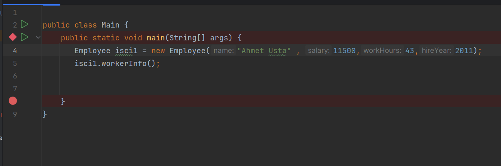
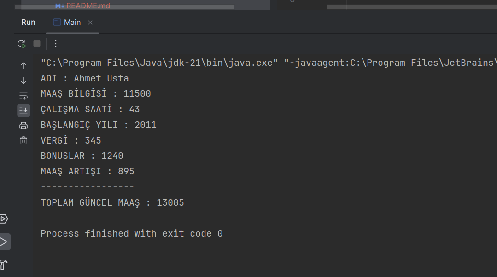

# Maaş Hesaplayıcı Program 

 Bu program java Constructor() Method'unu kullanarak yapılmış bir maaş hesaplayıcıdır.

---
 - Çalışanlara verilen bir kaç parametre değerine göre total maaş hesaplanır.
 

---
- Çalışanın bütün bilgilerine  isci1.workerInfo(); komutuyla ulaşabiliriz.
---

