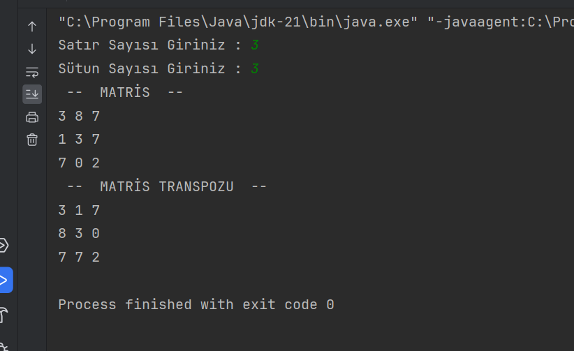

## Matris Transpozu Bulan Program

- Kullanıcıdan alınan satır sütun değerlerine göre rastgele sayılarla matris oluşturulur.

- Yeni oluşturuduğumuz dizi içerisinde matrisin transpozu (devriği) oluşturulur.

